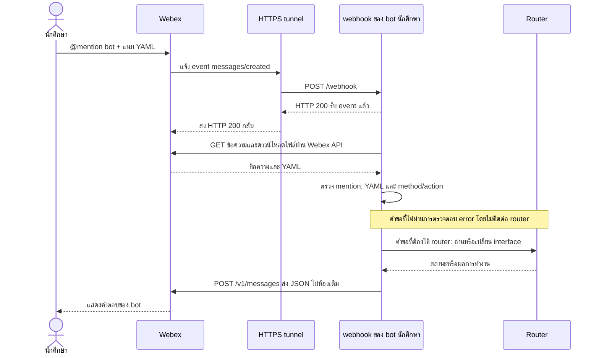
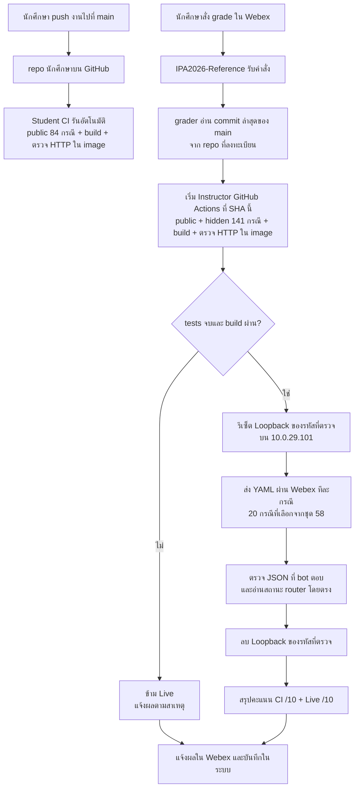

# IPA2026 Final Exam — Student Starter

## เป้าหมายของงาน

สร้าง Webex bot ที่รับการ @mention พร้อมไฟล์ YAML **หนึ่งไฟล์ในข้อความเดียวกัน** ตรวจคำขอ ทำงานกับ router และตอบผลเป็น JSON **ในห้องที่ได้รับข้อความ** โปรแกรมต้องรองรับ `status`, `plan`, `apply`, `delete` ตาม backend ที่กำหนด

Starter นี้ยังไม่มีคำตอบ จุด `TODO` เป็นคอมเมนต์บอกงาน, `pass` เป็นโค้ดว่าง และ `raise NotImplementedError` ทำให้ฟังก์ชันหยุดเมื่อถูกเรียก **ให้เขียนฟังก์ชันเหล่านี้ใน `app/`** ตามข้อกำหนดใน `specs/` ซึ่งอยู่ใน repo เดียวกัน

## ใน repo มีอะไรบ้าง

| ที่อยู่ | ใช้ทำอะไร | นักศึกษาต้องทำอะไร |
|---|---|---|
| `app/` | โค้ดหลักสำหรับอ่าน YAML, วางแผน, ติดต่อ router และตอบ Webex | **เขียนฟังก์ชันที่ยังไม่เสร็จ** |
| `app/backends/` | โค้ด RESTCONF, NETCONF, Ansible และ Netmiko/TextFSM | เขียน backend ตามความสามารถที่กำหนด |
| `ansible/` | playbook และ inventory ที่เกี่ยวกับ Ansible | ทำให้ backend Ansible ใช้งานได้ตาม spec |
| `specs/` | ข้อกำหนดของ input, output, backend, Webex และการตรวจ | อ่านเป็นเกณฑ์หลักก่อนเขียนแต่ละส่วน |
| `tests/` | **โปรแกรม Python สำหรับรันทดสอบ** | รันให้ผ่าน **ไม่ควรแก้ tests ที่ให้มา** |
| `sample-tests/` | ข้อมูลตัวอย่าง: cases, fixtures และ YAML สำหรับลอง Live | อ่านตัวอย่างและเพิ่ม cases/fixtures ของตนได้ |
| `requirements.txt` | Python packages ที่ต้องติดตั้ง | ใช้ติดตั้ง dependencies |
| `Dockerfile` | สร้าง image ที่มีโค้ด bot และ Ansible | ใช้เป็นจุดเริ่มต้นและตรวจว่า build ผ่าน |
| `compose.yaml` | เปิด service `webhook` พร้อม health check | ตั้ง environment ของตนและใช้เปิด bot |
| `.github/workflows/student-ci.yaml` | รัน public tests, build และตรวจ HTTP ใน image เมื่อ push `main` | ดูผล GitHub Actions ของ commit ล่าสุด |
| `scripts/check_webhook_image.py` | ตรวจโค้ดและ HTTP ภายใน image โดยไม่ใช้ token | รันหลัง `docker compose build webhook` |
| `README.md` | ภาพรวมและลำดับการทำงาน | เริ่มอ่านจากไฟล์นี้ |

Starter ให้ไฟล์ Docker และ Student CI พื้นฐานมาครบแล้ว นักศึกษาไม่ต้องสร้างสามไฟล์นี้จากศูนย์ แต่ต้องทำโค้ดใน `app/` ให้ใช้งานได้จริง เปิด bot ของตน และปรับการตั้งค่า deployment ให้เข้ากับสภาพแวดล้อมของตน **ห้ามใส่ token หรือรหัสผ่านใน repo**

## ภาพรวม: bot รับคำขออย่างไร

นักศึกษา @mention bot ของตนและแนบ YAML ในห้อง IPA2026 จากนั้น Webex แจ้งเหตุการณ์ใหม่ไปยัง HTTPS tunnel ของ bot (Cloudflare เป็นเพียงตัวอย่างของ tunnel) โดย event แจ้ง **รหัสข้อความ** ไม่ได้ส่งเนื้อหา YAML ให้ bot โดยตรง



**HTTP 200 จาก `/webhook` แปลว่ารับ event แล้ว** ยังไม่ใช่ผลของ YAML หลังประมวลผล bot จึงส่ง JSON เป็นข้อความใหม่ไปที่ Webex API **โดยตรง** ไม่ต้องส่งคำตอบย้อนผ่าน tunnel โปรแกรมต้องจัดการคำขอทีละรายการเพื่อไม่ให้การเปลี่ยน router ซ้อนกัน

## งานแต่ละส่วน

| ส่วน | งานและไฟล์หลัก | Spec หลัก | คะแนน CI |
|---|---|---|---:|
| Part 1 | ตรวจ mention และ YAML: `app/core.py`, `app/request_handler.py` | `desired-state-spec-v1.md`, `response-spec-v1.md` | 2 |
| Part 2 | วางแผน `create/update/no_change`: `app/planner.py` | `plan-spec-v1.md` | 2 |
| Part 3 | เชื่อม router: `app/backends/` | `backend-spec-v1.md` | 4 |
| Part 4 | เชื่อมส่วนต่าง ๆ, Webex และ Docker: `app/dispatcher.py`, `app/integration.py`, `app/webex_client.py`, `app/webhook_server.py` | `integration-spec-v1.md`, `live-test-part4.md` | 2 |

ชื่อ spec ในตารางอยู่ใต้ `specs/` ทั้งหมด RESTCONF และ NETCONF รองรับ status/plan/apply; Ansible รองรับ apply; Netmiko/TextFSM รองรับ status/delete

## รูปแบบ YAML และความต่างของคำสั่ง

YAML หนึ่งไฟล์คือ **หนึ่งคำขอที่สมบูรณ์ในตัวเอง** มี `version`, `router`, `method`, `action` และ `desired.interface` โปรแกรมต้องอ่านไฟล์ ตรวจรูปแบบและตรวจว่า backend รองรับ action นั้น ก่อนทำงานกับ router

ตัวอย่างนี้ใช้รหัสสมมติ `66070123` และ interface เดียวกันเพื่อให้เห็นลำดับการทำงาน **ก่อนทดลองจริงให้เปลี่ยน router และ interface เป็นค่าที่ตนได้รับมอบหมาย; สำหรับ `plan`/`apply` ให้ใส่ `ipv4`, `description`, `admin_state` ครบตาม spec**

```yaml
version: 1
router: 10.0.29.101
method: restconf
action: status
desired:
  interface:
    name: Loopback66070123
```

| Action | ความหมาย | เปลี่ยน router หรือไม่ | ตัวอย่างผล |
|---|---|---|---|
| `status` | อ่านว่า interface มีอยู่หรือไม่ และค่าปัจจุบันคืออะไร | ไม่ | `found` หรือ `not_found` |
| `plan` | เทียบค่าปัจจุบันกับ `desired.interface` แล้วบอกว่าจะ `create`, `update` หรือ `no_change` | **ไม่** | `planned` พร้อม `operation` และ `changes` |
| `apply` | ทำให้ interface บน router มีค่าตาม `desired.interface` | **เปลี่ยนจริง** | `applied` |
| `delete` | ลบ interface ตามชื่อที่ระบุ | **เปลี่ยนจริง** | `deleted`; ถ้าลบซ้ำได้ `not_found` |

## ตัวอย่างทดสอบ bot ของตัวเอง

ใช้บัญชี Webex ของนักศึกษา @mention **bot ของตัวเองจริง ๆ** และแนบ YAML หนึ่งไฟล์ในข้อความเดียวกัน แต่ละตัวอย่างด้านล่างคือ **ข้อความ Webex คนละครั้ง** ยกเว้นตัวอย่างที่ 1 ซึ่งจงใจไม่แนบไฟล์

ตัวอย่างสมมติว่า `Loopback66070123` เป็น interface ที่นักศึกษาได้รับอนุญาตให้ใช้บน `10.0.29.101` ก่อนทดลองต้องเปลี่ยน router, interface และ IP เป็นค่าที่ตนได้รับมอบหมาย **ห้ามลบ interface ของผู้อื่น**

ไฟล์ YAML ของตัวอย่างข้อ 2–10 อยู่ใน [sample-tests/webex-manual/](sample-tests/webex-manual/) สำหรับแนบส่งให้ bot ทีละไฟล์ตามลำดับ ไฟล์ชุดนี้ใช้ลองผ่าน Webex ด้วยมือ ไม่ได้ถูกรันโดย pytest; ส่วน public cases ที่ pytest ใช้อยู่ในโฟลเดอร์ `cases/` และ `fixtures/`

### เลือก `method` และ `action` ให้เข้าคู่กัน

`action` บอกว่า **ต้องการทำอะไร** ส่วน `method` บอกว่า **จะใช้วิธีใดคุยกับ router** ไม่ใช่ทุกวิธีจะทำได้ทุกงาน

| `method` | `status` อ่านสถานะ | `plan` วางแผน | `apply` เปลี่ยนจริง | `delete` ลบจริง |
|---|:---:|:---:|:---:|:---:|
| `restconf` | ✓ | ✓ | ✓ | — |
| `netconf` | ✓ | ✓ | ✓ | — |
| `ansible` | — | — | ✓ | — |
| `netmiko-textfsm` | ✓ | — | — | ✓ |

ถ้า `method` เป็นค่าที่รู้จัก แต่จับคู่กับ `action` ที่วิธีนั้นไม่รองรับ เช่น `restconf` + `delete` หรือ `ansible` + `status` bot ต้องตอบ:

```json
{"status":"error","result":"invalid_action"}
```

ตัวอย่างผลลัพธ์ด้านล่างแสดง key สำคัญ ลำดับ key และช่องว่างใน JSON อาจต่างกัน

### 1. Mention bot แต่ไม่แนบ YAML

**ก่อนส่ง:** ไม่ต้องทราบสถานะ router เพราะคำขอนี้จะหยุดตั้งแต่ขั้นตรวจข้อความ

**ส่ง:** @mention bot ของตัวเอง โดยไม่แนบไฟล์

**bot ควรตอบ:**

```json
{"status":"error","result":"no_yaml"}
```

**หลังส่ง:** Router ไม่เปลี่ยน กรณีนี้ยังไม่มี `method` หรือ `action` ให้ตรวจ

### 2. แนบ YAML ที่อ่านไม่ได้

**ก่อนส่ง:** ไม่ต้องทราบสถานะ router

**ส่ง:** @mention bot และแนบไฟล์ที่มีเนื้อหานี้

```yaml
version: 1
desired: [interface
```

**ไฟล์สำหรับลองส่ง:** [02-invalid-yaml.yaml](sample-tests/webex-manual/02-invalid-yaml.yaml)

**bot ควรตอบ:**

```json
{"status":"error","result":"invalid_yaml"}
```

**หลังส่ง:** Router ไม่เปลี่ยน โปรแกรมอ่าน YAML ไม่สำเร็จ จึงยังไม่ไปตรวจ `method` หรือ `action`

### 3. `status`: ตรวจเมื่อ interface ยังไม่มี

**ก่อนส่ง:** `Loopback66070123` ยังไม่มีบน router

**ส่ง:**

```yaml
version: 1
router: 10.0.29.101
method: restconf
action: status
desired:
  interface:
    name: Loopback66070123
```

**ไฟล์สำหรับลองส่ง:** [03-status-not-found.yaml](sample-tests/webex-manual/03-status-not-found.yaml)

**bot ควรตอบ:**

```json
{"status":"ok","result":"not_found","interface":null}
```

**หลังส่ง:** Interface ยังไม่มี `restconf` ใช้กับ `status` ได้ และ `status` อ่านค่าอย่างเดียว `not_found` จึงไม่ใช่ error

**ค่าใน `status`:** ต้องใส่เพียง `desired.interface.name` พร้อม `version`, `router`, `method` และ `action` ฟิลด์ `ipv4`, `description` และ `admin_state` ใส่เพิ่มได้ แต่ bot จะละเลยค่าเหล่านั้น และตอบ `found` พร้อมค่าจริงที่อ่านจาก router หรือ `not_found` หากไม่พบ interface

### 4. `plan`: ดูว่าจะต้องสร้างอะไร

**ก่อนส่ง:** Interface ยังไม่มี ตามตัวอย่างที่ 3

**ส่ง:**

```yaml
version: 1
router: 10.0.29.101
method: restconf
action: plan
desired:
  interface:
    name: Loopback66070123
    ipv4: 172.23.123.1/32
    description: IPA2026-66070123
    admin_state: up
```

**ไฟล์สำหรับลองส่ง:** [04-plan-create.yaml](sample-tests/webex-manual/04-plan-create.yaml)

**bot ควรตอบ:**

```json
{
  "status": "ok",
  "result": "planned",
  "operation": "create",
  "changes": {
    "ipv4": {"to": "172.23.123.1/32"},
    "description": {"to": "IPA2026-66070123"},
    "admin_state": {"to": "up"}
  }
}
```

**อ่านผล `plan`:** `name: Loopback66070123` ใน YAML ใช้ระบุ interface เป้าหมาย จึงไม่ใส่ `name` หรือ `interface` ใน `changes` ค่า `changes` แสดงเฉพาะ `ipv4`, `description` และ `admin_state` ที่ต้องจัดการ กรณี `create` จะแสดงค่า `to` ของทั้งสามรายการ; กรณี `update` จะแสดงเฉพาะค่าที่ต่าง; ถ้าค่าตรงกันทั้งหมดจะได้ `operation: no_change` และ `changes: {}`

**หลังส่ง:** Interface **ยังไม่มี** `restconf` ใช้กับ `plan` ได้ แต่ `plan` เพียงบอกว่าจะทำอะไร ไม่เปลี่ยน router

### 5. `apply`: สร้าง interface จริง

**ก่อนส่ง:** Interface ยังไม่มี

**ส่ง:**

```yaml
version: 1
router: 10.0.29.101
method: restconf
action: apply
desired:
  interface:
    name: Loopback66070123
    ipv4: 172.23.123.1/32
    description: IPA2026-66070123
    admin_state: up
```

**ไฟล์สำหรับลองส่ง:** [05-apply-create.yaml](sample-tests/webex-manual/05-apply-create.yaml)

**bot ควรตอบ:**

```json
{"status":"ok","result":"applied"}
```

**หลังส่ง:** Router ควรมี interface ตาม YAML เพราะ `restconf` ใช้กับ `apply` ได้ และ `apply` เป็นคำสั่งเปลี่ยน router จริง

**นักศึกษาตรวจผลอย่างไร:** ส่ง **ข้อความ Webex ใหม่อีกหนึ่งครั้ง** โดยแนบ YAML `status` ในตัวอย่างที่ 6 bot จะตอบคำขอใหม่นั้นอีกหนึ่งครั้ง ไม่ได้ส่ง `status` อัตโนมัติจากคำขอ `apply`

### 6. `status`: อ่านค่ากลับหลัง `apply`

**ก่อนส่ง:** ตัวอย่างที่ 5 เพิ่งสร้าง interface

**ส่งข้อความใหม่:**

```yaml
version: 1
router: 10.0.29.101
method: restconf
action: status
desired:
  interface:
    name: Loopback66070123
```

**ไฟล์สำหรับลองส่ง:** [06-status-found.yaml](sample-tests/webex-manual/06-status-found.yaml)

**bot ควรตอบ:**

```json
{
  "status": "ok",
  "result": "found",
  "interface": {
    "name": "Loopback66070123",
    "ipv4": "172.23.123.1/32",
    "description": "IPA2026-66070123",
    "admin_state": "up"
  }
}
```

**หลังส่ง:** Router ไม่เปลี่ยน `restconf` ใช้กับ `status` ได้ ให้เทียบค่าที่อ่านกลับมาทั้ง IP, description และ admin state กับ YAML ที่ส่งตอน `apply`

### 7. `plan`: ตรวจว่าค่าตรงกันแล้ว

**ก่อนส่ง:** Interface บน router มีค่าตรงกับ YAML ทุกช่อง

**ส่ง:**

```yaml
version: 1
router: 10.0.29.101
method: restconf
action: plan
desired:
  interface:
    name: Loopback66070123
    ipv4: 172.23.123.1/32
    description: IPA2026-66070123
    admin_state: up
```

**ไฟล์สำหรับลองส่ง:** [07-plan-no-change.yaml](sample-tests/webex-manual/07-plan-no-change.yaml)

**bot ควรตอบ:**

```json
{"status":"ok","result":"planned","operation":"no_change","changes":{}}
```

**หลังส่ง:** Router ไม่เปลี่ยน `restconf` ใช้กับ `plan` ได้ และ `no_change` หมายถึงค่าปัจจุบันตรงกับค่าที่ต้องการแล้ว

### 8. ใช้ `method` กับ `action` ผิดคู่

**ก่อนส่ง:** Interface ยังมีอยู่ แต่คำขอนี้ต้องถูกปฏิเสธก่อนลบ

**ส่ง:** ตั้งใจใช้ `restconf` + `delete` ซึ่งไม่มีเครื่องหมาย ✓ ในตาราง

```yaml
version: 1
router: 10.0.29.101
method: restconf
action: delete
desired:
  interface:
    name: Loopback66070123
```

**ไฟล์สำหรับลองส่ง:** [08-invalid-action.yaml](sample-tests/webex-manual/08-invalid-action.yaml)

**bot ควรตอบ:**

```json
{"status":"error","result":"invalid_action"}
```

**หลังส่ง:** Interface ต้องยังอยู่ โปรแกรมต้องไม่พยายามลบผ่าน RESTCONF แม้ YAML จะอ่านได้และชื่อ interface ถูกต้อง ถ้าต้องการลบ ให้ใช้ `netmiko-textfsm` ตามตัวอย่างถัดไป

### 9. `delete`: ลบ interface ที่สร้างไว้

**ก่อนส่ง:** `Loopback66070123` ยังอยู่บน router

**ส่ง:**

```yaml
version: 1
router: 10.0.29.101
method: netmiko-textfsm
action: delete
desired:
  interface:
    name: Loopback66070123
```

**ไฟล์สำหรับลองส่ง:** [09-delete.yaml](sample-tests/webex-manual/09-delete.yaml)

**bot ควรตอบ:**

```json
{"status":"ok","result":"deleted"}
```

**หลังส่ง:** Interface ควรถูกลบ `netmiko-textfsm` ใช้กับ `delete` ได้ และคำขอ `delete` ต้องการเพียงชื่อ interface หากอยากเช็กผล ให้ส่ง **ข้อความ `status` ใหม่** เช่น YAML ในตัวอย่างที่ 3 ซึ่งตอนนี้ควรตอบ `not_found` พร้อม `interface: null`

### 10. `delete` ซ้ำเมื่อ interface ไม่มีแล้ว

**ก่อนส่ง:** Interface ถูกลบไปแล้วในตัวอย่างที่ 9

**ส่ง:**

```yaml
version: 1
router: 10.0.29.101
method: netmiko-textfsm
action: delete
desired:
  interface:
    name: Loopback66070123
```

**ไฟล์สำหรับลองส่ง:** [10-delete-again.yaml](sample-tests/webex-manual/10-delete-again.yaml)

**bot ควรตอบ:**

```json
{"status":"ok","result":"not_found","interface":null}
```

**หลังส่ง:** Interface ยังคงไม่มี การลบซ้ำต้องไม่ทำให้ bot ล้ม และต้องไม่ไปลบ interface อื่น

ตัวอย่างเหล่านี้ใช้ตรวจ bot ของตนเองก่อนส่งงาน การตรวจอย่างเป็นทางการเริ่มเมื่อส่ง `grade` ให้ instructor bot หลัง `verify` ผ่าน ระบบจะสุ่มเลือก Live 20 กรณีจากชุดทดสอบที่ใหญ่กว่า 20 กรณี จึงต้องทำตาม spec ไม่ใช่เขียนให้ตอบเฉพาะค่าของตัวอย่าง

**ห้าม apply หรือ delete interface ของผู้อื่น** หาก `status` พบ interface ที่ไม่ใช่ของตน ให้หยุดก่อนทำขั้นตอนที่เปลี่ยน router ดูรูปแบบและข้อผิดพลาดทั้งหมดใน `specs/desired-state-spec-v1.md` และ `specs/response-spec-v1.md`

## ใช้ `tests/` และ `sample-tests/` อย่างไร

`tests/` คือ **โปรแกรมที่รันทดสอบ** ส่วน `sample-tests/` เป็น **ข้อมูลที่บางโปรแกรมใน `tests/` อ่าน** เช่น case ระบุ input และผลที่คาดหวัง ส่วน fixture เก็บข้อมูลที่ case ใช้

- นักศึกษา **ไม่ควรแก้โปรแกรมทดสอบที่ให้มาใน `tests/`** ให้แก้โค้ดใน `app/` จน tests ผ่าน
- โปรแกรมทดสอบบางไฟล์ของ Parts 1–3 ค้นหา `cases/*.yaml` อัตโนมัติ นักศึกษาเพิ่ม case พร้อม fixture ตามรูปแบบเดิมได้ **โดยไม่ต้องแก้ `tests/`**
- บาง tests เขียนกรณีไว้ใน Python โดยตรง ไม่ได้อ่าน `sample-tests/` ส่วน `sample-tests/webex-manual/` เป็นชุด YAML ที่ตรงกับตัวอย่างข้อ 2–10 และ `sample-tests/part4/live/` เป็น YAML ตัวอย่างพื้นฐาน ทั้งสองโฟลเดอร์ใช้ส่งให้ Webex bot ด้วยมือ ไม่ถูก pytest เก็บอัตโนมัติ
- ตัวอย่าง: `tests/test_part1.py` อ่าน `sample-tests/part1/cases/`; `tests/test_part1_mentions.py` ตรวจ mention และกรณีไม่แนบไฟล์ที่เขียนไว้ใน Python โดยตรง
- การเพิ่มกรณีทดสอบช่วยตรวจงานของตน **ไม่เพิ่มคะแนนโดยตรง** เพราะการตรวจจริงใช้ tests และ cases ของผู้สอน

ติดตั้ง dependencies แล้วรัน public tests ซึ่งมี 84 กรณี:

```bash
python3 -m venv .venv
. .venv/bin/activate
python -m pip install -r requirements.txt
python -m pytest -q tests
```

การผ่าน public tests ยังไม่รับประกันว่าจะผ่าน hidden tests

## ลำดับการทำงาน

1. นำ Starter ไปสร้าง **GitHub repo งานของตนเอง** ทำงานบน branch `main` หาก repo เป็น private ต้องให้ผู้สอนอ่านได้
2. ทำ Parts 1–4 ตาม spec รัน public tests ระหว่างทำ
3. ใช้ `Dockerfile`, `compose.yaml` และ `.github/workflows/student-ci.yaml` ที่ให้มา ตรวจว่า public tests, `docker compose build webhook` และ `python scripts/check_webhook_image.py` ผ่าน แล้วปรับ deployment ของตนตาม spec ไม่ต้อง publish image ไป Docker Hub
4. สร้าง Webex bot ของตน ตั้ง **ชื่อแสดงเป็นรหัสนักศึกษา 8 หลัก** เพิ่ม bot เข้าห้อง **IPA2026 ก่อนลงทะเบียน** แล้วเปิดโปรแกรม, webhook และ tunnel ให้พร้อมรับข้อความ
5. ลอง @mention bot ของตนพร้อม YAML หนึ่งไฟล์ ทดลอง `status → plan → apply → status → delete → delete ซ้ำ` บน **interface ที่ตนได้รับมอบหมายเท่านั้น** `plan` ไม่แก้ router; `apply` และ `delete` แก้สถานะจริง ดู [ชุด YAML สำหรับลองส่งทีละข้อ](sample-tests/webex-manual/) ตัวอย่างพื้นฐานใน `sample-tests/part4/live/` และขั้นตอนใน `specs/live-test-part4.md`
6. Push งานขึ้น `main` รอ Student CI ของ commit ล่าสุดผ่าน แล้วจึง `register → verify → grade → score`

เมื่อสั่ง `grade` ระบบจะแจ้งว่า ก่อน Live จะลบ `Loopback<รหัสนักศึกษา>` บน `10.0.29.101` แม้จะค้างจากการลองส่งเอง และจะลบอีกครั้งเมื่อจบ จึงไม่ต้องลบเองก่อนตรวจ ระบบไม่ลบ interface ชื่ออื่น ห้ามใช้ IP ในช่วง `192.0.2.128/27` สำหรับการทดลองของตน เพราะสงวนไว้ให้ Live test; bot ยังต้องรองรับคำขอที่ grader ส่งในช่วงนี้

## บัญชี Webex สองบัญชีของนักศึกษา

สมมตินักศึกษารหัส **66070123**:

| บัญชี | ใช้ทำอะไร |
|---|---|
| **บัญชีคน** `66070123@kmitl.ac.th` | นักศึกษาใช้พูดคุยใน Webex, ทดลองส่ง YAML ให้ bot ของตน และส่งคำสั่งตรวจให้ `IPA2026-Reference` |
| **บัญชี bot** ชื่อแสดง `66070123` | เป็นโปรแกรมที่นักศึกษาเขียน รับ YAML และตอบ JSON; ระบบผู้สอนจะส่ง Live test มาหา bot นี้ |

`IPA2026-Reference` เป็น **bot ผู้ตรวจของผู้สอน** ไม่ใช่ bot ที่นักศึกษาต้องเขียน ต้องเพิ่ม bot ของนักศึกษาเข้าห้อง IPA2026 ก่อน `register` และเปิด webhook/tunnel ไว้จนตรวจ Live เสร็จ

เวลา @mention ต้อง **เลือก bot จากรายการของ Webex จริง** การพิมพ์ `@ชื่อบอต` เป็นข้อความธรรมดาไม่พอ ถ้า mention bot นักศึกษาโดยไม่แนบ YAML ควรได้ `{"status":"error","result":"no_yaml"}`; ถ้าแนบมากกว่าหนึ่งไฟล์ควรได้ `{"status":"error","result":"multiple_attachments"}`

## Student CI, การตรวจ CI จริง และ Live



`push` ทำให้ **Student CI** รันเอง แต่ยังไม่เริ่มการตรวจคะแนนของผู้สอน หลัง `register` ผูก repo กับ bot แล้ว นักศึกษาอาจใช้ `verify` เช็ก Student CI ของ commit ล่าสุดและลองถาม bot แบบไม่แนบ YAML โดยไม่ใช้สิทธิส่งตรวจ **เมื่อสั่ง `grade` ใน Webex เท่านั้น** `IPA2026-Reference` จึงอ่าน commit ล่าสุดของ `main` จาก repo ที่ลงทะเบียนและเริ่ม official CI หาก tests จบและ build ผ่าน จึงเริ่ม Live โดยส่งคำขอผ่าน Webex ไปยัง bot นักศึกษา และ grader อ่าน router เองเพื่อตรวจผลจริง

- **Student CI**: workflow ที่ให้มาทำงานหลัง push `main` รัน public tests, build service `webhook` และตรวจ HTTP `/health` กับ `/webhook` ภายใน image โดยไม่ใช้ token ดูผลใน repo ของตนที่ **Actions → Student CI → run ของ commit ล่าสุด** ขั้น **Run public tests** แสดงจำนวนที่ผ่าน/ไม่ผ่านและรายละเอียดกรณีที่ไม่ผ่าน เช่น `84 passed`; ขั้น **Build webhook image** และ **Check webhook inside built image** แสดงผลผ่าน/ไม่ผ่านแยกกัน หากขั้นก่อนหน้าไม่ผ่าน ขั้นถัดไปจะถูกข้าม Student CI ไม่แสดงคะแนนทางการ CI/Live และไม่ส่งผลไปห้อง Webex อัตโนมัติ
- **การตรวจ CI จริง**: เมื่อสั่ง `grade` ผู้สอนดึง **commit ล่าสุดของ `main`** ไปรัน public และ hidden tests รวม 141 กรณี พร้อมตรวจ Docker build และ HTTP ภายใน image คะแนน CI คำนวณจาก tests ตามน้ำหนัก Parts 1–4 ในตาราง หาก build หรือการตรวจ image ไม่ผ่าน จะบันทึกคะแนน CI ที่ tests ทำได้และ **ไม่ตรวจ Live**
- ขั้นรัน **141 tests จำกัดเวลา 120 วินาที** หากหมดเวลาก่อนมีผลครบ จะข้าม Live; เวลา 120 วินาทีนี้ไม่รวม checkout, ติดตั้ง dependencies, build และตรวจ image ซึ่งอยู่ใน workflow เดียวกัน โดย workflow ทั้งงานมีเพดาน 5 นาที
- **Live test**: เมื่อ CI/build พร้อม ระบบส่ง YAML ผ่าน Webex ไปยัง bot นักศึกษา **ทีละกรณี 20 กรณี** ที่เลือกจากชุด 58 กรณี ตรวจทั้ง JSON ที่ตอบและสถานะจริงบน router คิดเป็น **10 คะแนน** กรณี `apply` ต้องเปลี่ยน router จริง; หลังตรวจระบบ cleanup interface ของการทดสอบ

ใน Live ระบบรอคำตอบจาก bot **10 วินาทีต่อกรณีที่ไม่ต้องติดต่อ router** (ไม่แนบ YAML, YAML ผิดรูปแบบ, version/action ไม่ถูกต้อง) และ **20 วินาทีต่อกรณีที่ต้องอ่านหรือเปลี่ยน router** (`status`, `plan`, `apply`, `delete`) โดยเริ่มนับหลัง Webex ส่งคำขอสำเร็จ หาก bot ไม่ตอบทัน กรณีนั้นไม่ผ่านและระบบหยุดส่งกรณีที่เหลือ โดยนับกรณีที่เหลือว่าไม่ผ่าน เพื่อเปิดคิวให้คนถัดไป การส่งข้อความผ่าน Webex และการอ่าน router ใช้เวลาเพิ่มเติมได้ จึงไม่ใช่เพดานเวลารวมของกรณีหรือ Live ทั้งรอบ หากระบบผู้สอน, Webex หรือ router ขัดข้อง ระบบคืนสิทธิส่งตรวจครั้งนั้น

Take-home เต็ม **20 คะแนน = CI 10 + Live 10** ส่วน MCQ อีก 10 คะแนนสอบและเก็บผลแยกนอกระบบนี้

ให้คง service ชื่อ `webhook` ใน `compose.yaml` และให้ image เริ่มด้วย `python -m app.webhook_server` ตาม Dockerfile ที่ให้มา ตัวตรวจจะเปิด HTTP server จำลอง **ภายใน image** เพื่อเรียก `/health` และ `/webhook` โดยไม่ใช้ Webex token หรือ router การ build ผ่านอย่างเดียวจึงยังไม่พอ และการตรวจนี้ไม่ใช่การตรวจ Live กับ bot ที่เปิดใช้งานจริง

ตรวจบนเครื่องของตนก่อน push ได้ด้วยคำสั่งเดียวกับ Student CI:

```bash
python -m pytest -q tests
docker compose build webhook
python scripts/check_webhook_image.py
```

หลังเขียน webhook เสร็จ ให้เก็บ `WEBEX_BOT_TOKEN`, `ROUTER_USER`, `ROUTER_PASS` ใน environment หรือไฟล์ `.env` บนเครื่องที่รัน bot (`.env` ถูกละไว้ใน `.gitignore`) แล้วลอง `docker compose up -d webhook`, `docker compose ps` และ `curl http://127.0.0.1:8000/health` การเปิด bot จริงต้องมี token และการตั้ง webhook/tunnel ตาม `specs/integration-spec-v1.md`; Student CI ตรวจ tests, build และ HTTP ภายใน image โดยไม่ใช้ secret เหล่านี้

เมื่อ push แล้วให้ดูว่า **Student CI ผ่านที่ SHA ล่าสุดของ `main`** ก่อนส่ง `verify` เพราะ `verify` ตรวจผล workflow ชื่อ `student-ci.yaml` ของ SHA นั้นโดยตรง และไม่เริ่ม GitHub Actions ใหม่ให้ หากแก้ไฟล์แล้ว push อีกครั้ง ต้องรอผลของ SHA ใหม่

## ตัวอย่างการส่งตรวจในห้อง IPA2026

ตัวอย่างนี้สมมติว่า **บัญชีคน** `66070123@kmitl.ac.th` เพิ่ม bot ชื่อ `66070123` เข้าห้องและเปิดใช้งานแล้ว งานอยู่ที่ `https://github.com/myname/ipa2026-work` ซึ่งเป็น **repo ของนักศึกษาเอง** ให้เปลี่ยน URL ตัวอย่างเป็น URL งานจริงของตน **ห้ามใช้ URL ของ Student Starter**

ให้บัญชีคนเลือก mention `@IPA2026-Reference` จาก Webex แล้วส่ง **ทีละข้อความ โดยไม่แนบ YAML** ข้อความตอบกลับด้านล่างเป็นตัวอย่างสมมติ; SHA, หมายเลขงาน และคะแนนจริงขึ้นกับงานที่ส่ง

### 1. `register` — ลงทะเบียน repo และ bot

ส่ง:

```text
@IPA2026-Reference register https://github.com/myname/ipa2026-work
```

ตัวอย่างผล:

```text
ลงทะเบียนสำเร็จ: 66070123
Repo: myname/ipa2026-work
ส่ง verify เพื่อตรวจความพร้อม, grade เพื่อตรวจ, หรือ score เพื่อดูคะแนน
การลงทะเบียนไม่ใช้โควตาและไม่รีเซ็ตคะแนน
```

### 2. `verify` — ตรวจความพร้อมฟรี

ส่ง:

```text
@IPA2026-Reference verify
```

ตัวอย่างผลเมื่อพร้อม:

```text
Verify 66070123: พร้อม
main SHA: 0123456789abcdef0123456789abcdef01234567
Student CI ที่ SHA นี้: ผ่าน
Live no-YAML smoke: ผ่าน
ไม่ใช้โควตา และไม่ได้รัน Live 20 กรณี
```

`verify` ตรวจ Student CI ของ **SHA ที่แสดง** และลองให้ bot ตอบแบบไม่แนบ YAML ไม่เริ่ม GitHub Actions ของผู้สอน ไม่ใช้โควตา และไม่บังคับ แต่ควรทำก่อน `grade`

### 3. `grade` — ส่งตรวจจริง **ได้สูงสุด 10 ครั้ง**

ส่ง:

```text
@IPA2026-Reference grade
```

ตัวอย่างผลเมื่อรับงาน:

```text
รับเข้าคิวตรวจ งาน #12
Commit: 0123456789abcdef0123456789abcdef01234567
66070123
ใช้สิทธิส่งตรวจ: 1/10 ครั้ง
ส่งตรวจได้อีก: 9 ครั้ง
คะแนน Take-home สูงสุด: ยังไม่มีงานที่ตรวจครบ
MCQ: 10 คะแนน ตรวจและเก็บนอกระบบนี้
งานล่าสุด: เข้าคิว
ลำดับคิว CI: 1/1
ก่อน Live ระบบจะลบ Loopback66070123 บน 10.0.29.101 เพื่อเริ่มตรวจจากสถานะว่าง
จะแจ้งคะแนนอีกครั้งเมื่อตรวจเสร็จ
```

`งาน #12` เป็นเลขอ้างอิงงานในระบบที่ใช้ร่วมกันทุกคน **ไม่ใช่ลำดับคิว** และไม่ได้หมายความว่ามี 11 งานรอตรวจอยู่ก่อน ดูบรรทัด `ลำดับคิว CI: 1/1` สำหรับตำแหน่งในกลุ่มงานที่ **ยังรอ CI** ณ เวลาที่ตอบ; ตัวเลขนี้ไม่รวมงานที่กำลังตรวจ CI หรือรอ Live และจะเปลี่ยนตามคิวจริง

เมื่อตรวจเสร็จ ระบบส่งข้อความอีกครั้ง ตัวอย่างกรณีผ่านทั้งหมด:

```text
ตรวจเสร็จ — Build: ผ่าน
CI: 10/10
Live: 10/10
Take-home ครั้งนี้: 20/20
66070123
ใช้สิทธิส่งตรวจ: 1/10 ครั้ง
ส่งตรวจได้อีก: 9 ครั้ง
คะแนน Take-home สูงสุด: 20/20
MCQ: 10 คะแนน ตรวจและเก็บนอกระบบนี้
งานล่าสุด: ตรวจเสร็จ
คะแนน CI ล่าสุด: 10/10
คะแนน Live ล่าสุด: 10/10
```

ข้อความ `ตรวจเสร็จ` แสดงผล **ครั้งนี้** ก่อน แล้วตามด้วยสรุปของรหัสนักศึกษา: โควตาที่ใช้และเหลือ คะแนน Take-home สูงสุดจากการส่งครั้งเดียว และคะแนนของงานล่าสุด ถ้าส่งตรวจมาแล้ว 4 ครั้ง จะเห็น `ใช้สิทธิส่งตรวจ: 4/10 ครั้ง` และ `ส่งตรวจได้อีก: 6 ครั้ง` แทนตัวเลข 1/10 ในตัวอย่าง

`Build` คือผล build และตรวจ HTTP ใน image ของการตรวจจริง; `CI` เป็นคะแนนจาก public และ hidden tests; `Live` เป็นคะแนนจาก 20 กรณีที่เลือกมาตรวจ ส่วน MCQ แยกเก็บนอกระบบ หาก build ไม่ผ่าน จะไม่เริ่ม Live และแสดง `Live: 0/10` หาก official tests หมดเวลาหรือไม่มีรายงานผล ระบบจะเพิ่มบรรทัด `ข้าม Live: ...` ก่อนสรุปผล

ผลจริงอาจได้คะแนนต่ำกว่าตัวอย่าง `grade` ที่รับเป็นงานใหม่ **ใช้โควตาหนึ่งครั้ง** แม้โค้ด, tests, build หรือ bot ของนักศึกษามีปัญหา

### 4. `score` — ดูผลฟรี

ส่ง:

```text
@IPA2026-Reference score
```

ตัวอย่างผลหลังตรวจเสร็จ:

```text
66070123
ใช้สิทธิส่งตรวจ: 1/10 ครั้ง
ส่งตรวจได้อีก: 9 ครั้ง
คะแนน Take-home สูงสุด: 20/20
MCQ: 10 คะแนน ตรวจและเก็บนอกระบบนี้
งานล่าสุด: ตรวจเสร็จ
คะแนน CI ล่าสุด: 10/10
คะแนน Live ล่าสุด: 10/10
```

## โควตาและข้อควรระวัง

- `grade` ส่งตรวจจริงได้ **ไม่เกิน 10 ครั้ง**; `register`, `verify`, `score` ไม่ใช้โควตา
- หากแก้โค้ด ให้ push commit ใหม่และรอ Student CI ของ **commit ใหม่นั้น** ผ่านก่อน `grade` อีกครั้ง การสั่งตรวจ repo และ commit เดิมที่ตรวจเสร็จแล้วจะแสดงผลเดิม ไม่ใช้ครั้งใหม่
- ปัญหาของงานที่ส่ง เช่น tests/build ไม่ผ่าน, ใช้เวลานานเกินกำหนด หรือ bot ไม่ตอบ Live ใช้โควตา ความขัดข้องของระบบผู้สอน, GitHub, Webex หรือ router คืนโควตา
- คะแนนสูงสุดเลือกจาก **การส่งครั้งเดียว** ไม่ผสม CI และ Live จากต่างครั้ง
- ใช้ AI ช่วยทำ Take-home ได้ แต่ต้องตรวจผล เข้าใจและอธิบายโค้ดที่ส่งได้ด้วยตนเอง
- เก็บ `WEBEX_BOT_TOKEN`, `ROUTER_USER`, `ROUTER_PASS` ใน environment หรือ `.env` เท่านั้น **ห้าม commit `.env`, token หรือรหัสผ่าน**
